# Proposal Builder — End-to-End Walkthrough

A step-by-step record of building one complete proposal in the live app, captured
with Playwright on **2026-06-29**.

- **Environment:** production — <https://pb.ladcustomerservice.com>
- **Signed in as:** admin · ghansen@ladirrigation.com
- **Proposal built:** *Center Pivot Irrigation System* — Columbia Basin Farms, LLC (Quincy, WA) · LAD-2026-001
- **Result:** a 9-page document totaling **$259,921.52**, auto-saved to the cloud.

> All customer data below is realistic sample data created for this walkthrough.

---

## The finished cover

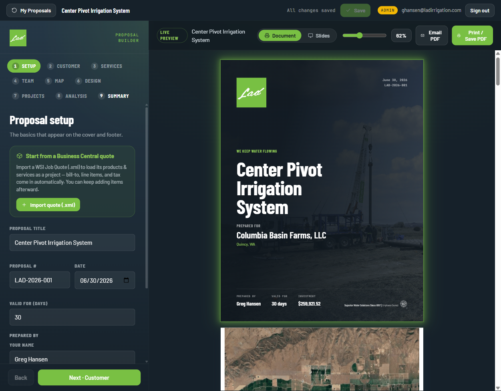

The cover pulls together everything entered in the wizard: title, customer, the
"prepared by" block, valid-for window, and the headline **Investment** figure —
over a full-bleed hero image.

---

## Step 0 — Start a proposal

From the **Proposals** dashboard, **New proposal** opens a chooser: import a
Business Central quote (`.xml`) to pre-fill everything, or **Start blank**. This
walkthrough started blank.

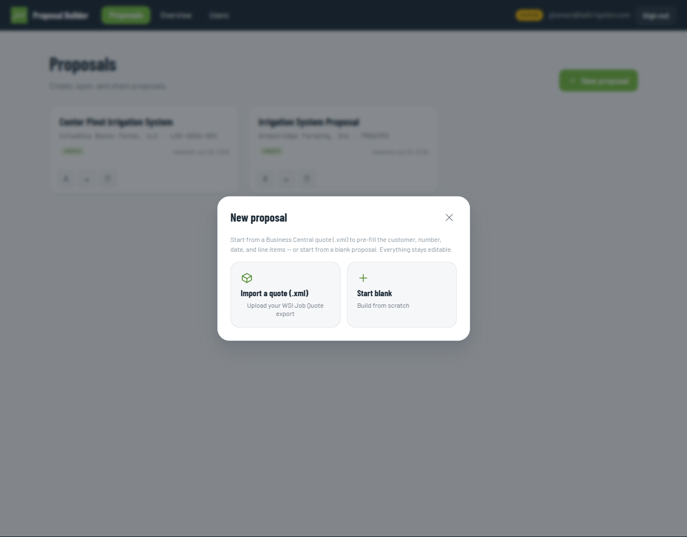

The builder is a **9-step wizard** (left) with a **live document preview** (right)
that updates as you type. Every step is revisitable from the numbered nav.

---

## Step 1 — Setup

The basics that appear on the cover and footer: title, proposal #, date,
valid-for window, and the "prepared by" details. Sensible defaults are
pre-filled (proposal #, today's date, the signed-in user).

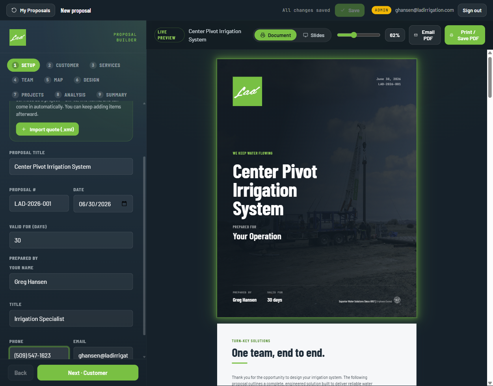

**Entered:** Title *Center Pivot Irrigation System* · Prepared by *Greg Hansen* ·
Phone *(509) 547-1623*.

---

## Step 2 — Customer

Who the proposal is for — shown on the cover.

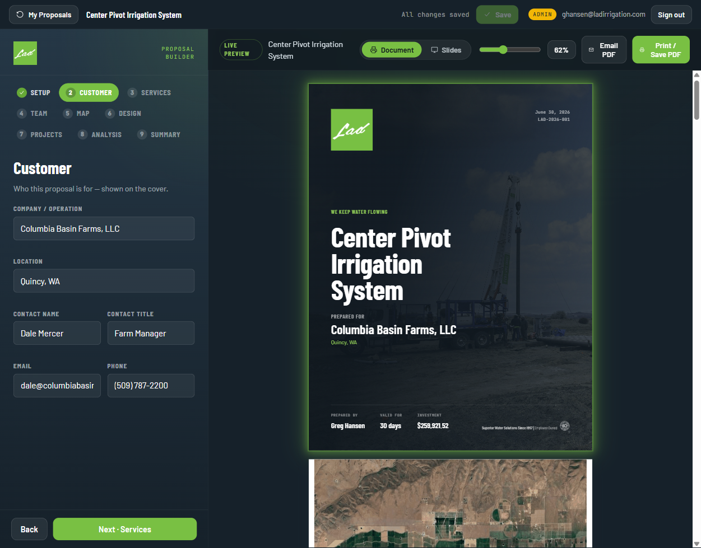

**Entered:** Columbia Basin Farms, LLC · Quincy, WA · Dale Mercer (Farm Manager) ·
dale@columbiabasinfarms.com · (509) 787-2200.

---

## Step 3 — Services

Toggle the capabilities to feature; each becomes a card on the services page, and
the cover message + "our approach" lines are editable.

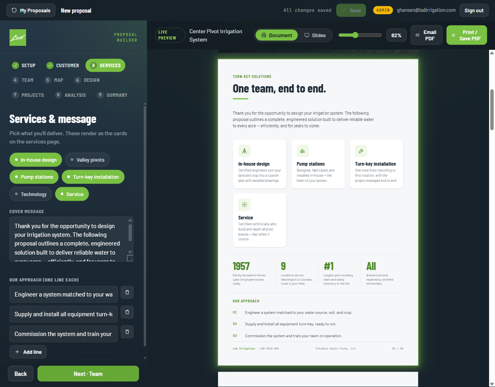

**Selected:** all six — In-house design, Valley pivots, Pump stations, Turn-key
installation, Technology, Service.

---

## Step 4 — Team

The company story (pre-written in Lad's voice) plus the people on the project,
added from the Lad roster with one click. About-Us and Locations pages are
toggled on here.

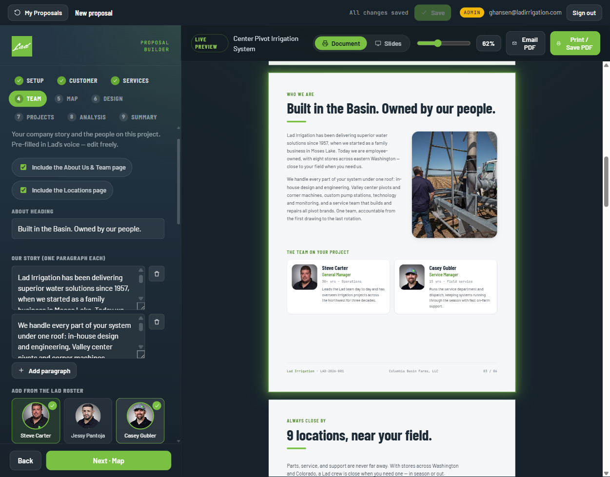

**Added:** Steve Carter (General Manager) and Casey Gubler (Service Manager).

---

## Step 5 — Map

Pull a satellite view straight from Google Maps (or upload your own), then it
renders as its own page with an engineering title block. Searching the customer's
town re-centers the map; **Use this view** captures exactly what's framed.

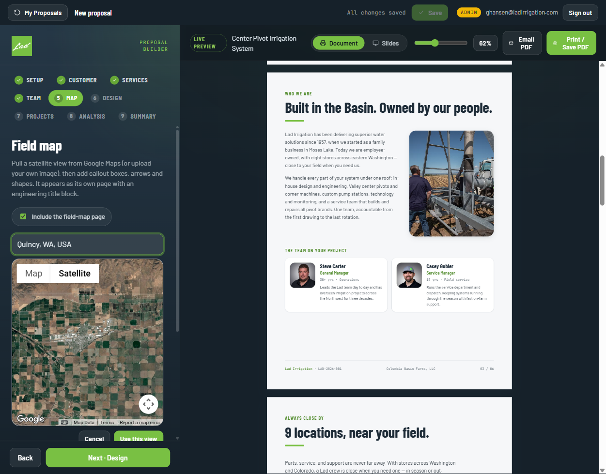

**Captured:** a satellite view of Quincy, WA farmland. Scale auto-filled to
*1 inch : 6,300 feet*; title block populated with customer, designer (Greg Hansen),
and drawn-by (S. Carter).

---

## Step 6 — Design calculators

Lad's system-design sheet, built in. Add only the calculators a proposal needs;
each computes live and can feed the analysis page.

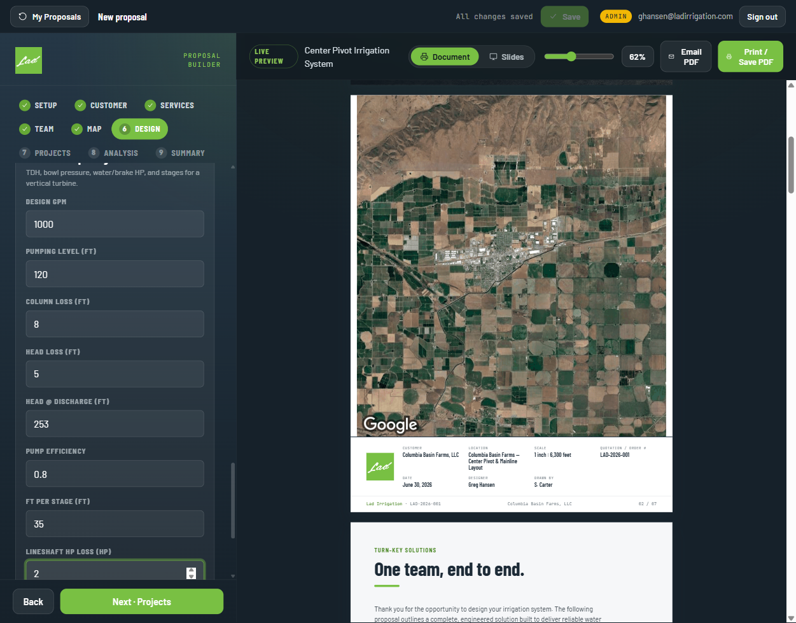

**Used:** hydraulic worksheet → **TDH 253 ft · 109.5 psi · 79.9 HP**; plus a pipe
friction segment (12" PIP mainline), Pivot Acreage, and Turbine Pump Design
calculators. The captured field-map page is visible in the preview with its
title block.

---

## Step 7 — Projects (line items & pricing)

Each project is a group of line items with one final cost and its own detailed
quote page. Tax rate is per-project.

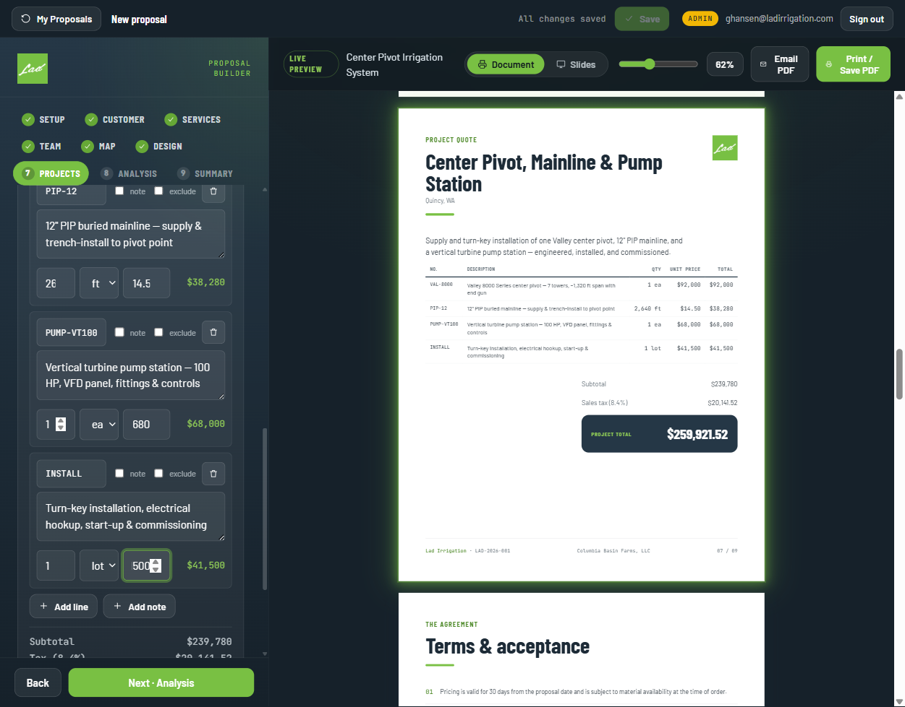

**Project:** *Center Pivot, Mainline & Pump Station* — 4 line items:

| SKU | Description | Qty | Unit | Total |
|---|---|--:|--:|--:|
| VAL-8000 | Valley 8000 Series center pivot — 7 towers, ~1,320 ft | 1 ea | $92,000 | $92,000 |
| PIP-12 | 12" PIP buried mainline — supply & trench-install | 2,640 ft | $14.50 | $38,280 |
| PUMP-VT100 | Vertical turbine pump station — 100 HP, VFD panel | 1 ea | $68,000 | $68,000 |
| INSTALL | Turn-key installation, hookup, start-up & commissioning | 1 lot | $41,500 | $41,500 |

**Subtotal $239,780 + 8.4% tax $20,141.52 = $259,921.52.**

> The narrow input boxes in the left panel visually truncate long numbers (e.g.
> "26", "680", "500") — the live preview confirms the real values are correct.

---

## Step 8 — Analysis (skipped, by design)

The optional **Improvements Analysis** is a before/after pressure comparison for
*upgrades*. This is a greenfield install — there's no existing system to compare —
and the step's defaults were stale sample data from another customer, so this page
was **left off** (its default state).

---

## Step 9 — Summary & terms

The investment rollup, an optional payment schedule, page toggles, and the
acceptance terms.

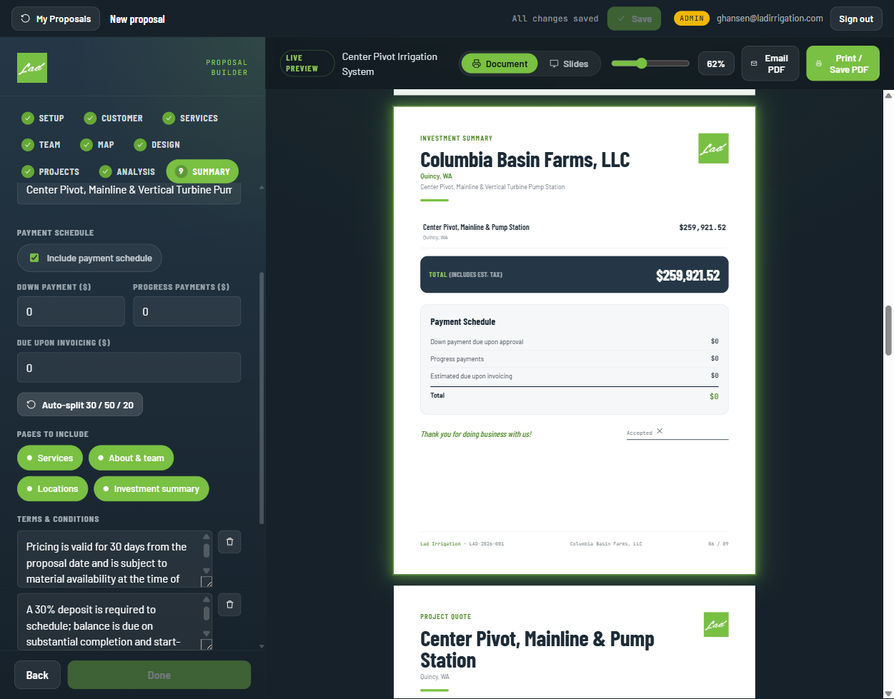

**Set:** subtitle *Center Pivot, Mainline & Vertical Turbine Pump Station*;
payment schedule via **Auto-split 30 / 50 / 20**:

| Milestone | Amount |
|---|--:|
| Down payment due upon approval | $77,976.46 |
| Progress payments | $129,960.76 |
| Estimated due upon invoicing | $51,984.30 |
| **Total** | **$259,921.52** |

---

## Saved to the cloud

Closing the wizard, the proposal lands in **My Proposals**, owned by the creator
and shareable.

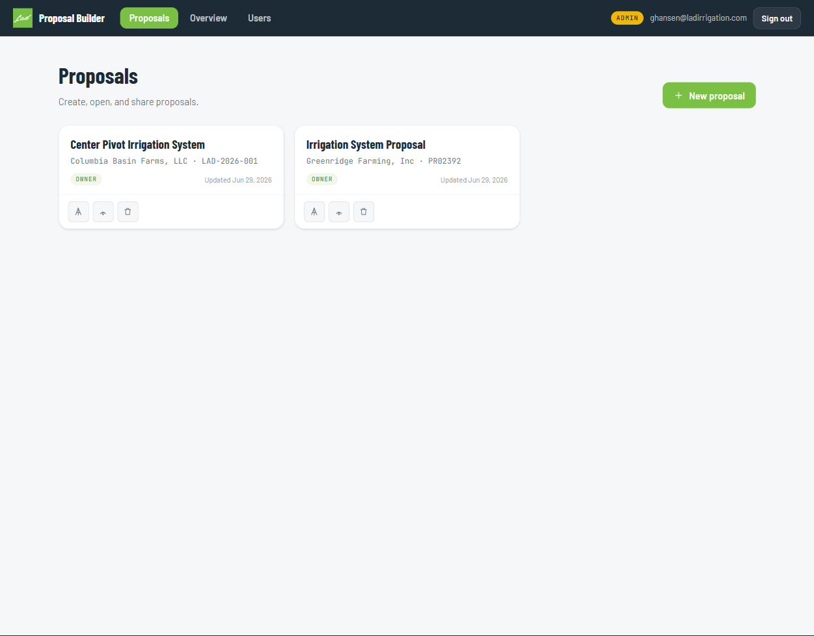

---

## Final document — page order

| # | Page |
|--:|---|
| 1 | Cover — customer, prepared-by, investment headline |
| 2 | Field map — Google satellite capture + engineering title block |
| 3 | Services — six capability cards + "our approach" |
| 4 | About & team — company story + Steve Carter, Casey Gubler |
| 5 | Locations — 9 stores, hours |
| 6 | Investment summary + payment schedule |
| 7 | Project quote — itemized, with tax |
| 8 | Terms & acceptance — signature block |
| 9 | Closing — "Put Lad to the test" call to action |

---

## Notes / issues observed

1. **Auto-split needed two clicks.** On Step 9, clicking *Auto-split 30 / 50 / 20*
   immediately after enabling the *Include payment schedule* checkbox did nothing
   (schedule stayed $0); a second click populated it. Enabling the checkbox appears
   to re-render the panel and swallow the first click.
2. **The "Done" button stays disabled** on the final step. The proposal auto-saves
   regardless ("All changes saved"), so it isn't blocking — but the wizard's
   terminal button is never enabled.
3. Output (Print / Save PDF, Email PDF) was **not** triggered in this run — the
   browser print dialog can hang automation.
